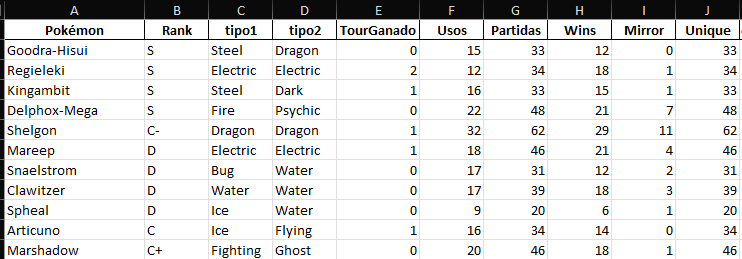
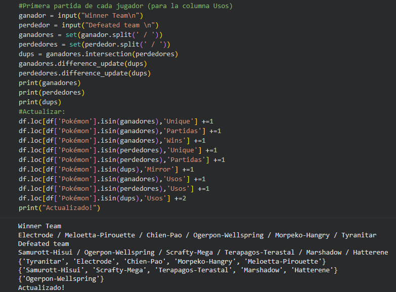
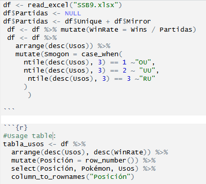
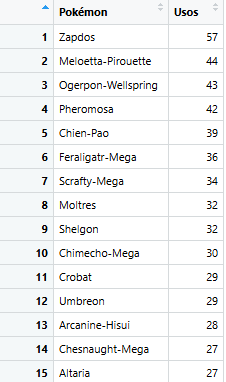

# Pokémon Showdown Tournament Tracker

A personal data pipeline built to track Pokémon usage and performance statistics across a custom competitive tournament series. The system covers data collection, processing, and public reporting across four tools.

---

## Pipeline Overview

```
Google Sheets  →  Python (Colab)  →  R Studio  →  Google Sheets (public)
  (raw data)       (live input)      (analysis)     (final report)
```

---

## 1. Data Structure

The base dataset was built manually. Each row represents a **Pokémon**, and columns track cumulative statistics across all tournaments.

| Column | Description |
|---|---|
| `Pokémon` | Pokémon name (Showdown format) |
| `Rank` | Competitive ranking estimate by the tournaments organizers. |
| `tipo1` / `tipo2` | Primary and secondary type (used for a randomizer)|
| `TourGanado` | +1 if the Pokémon was on the winning team of a tournament |
| `Usos` | Unique appearances per tournament — counted once per team |
| `Partidas` | Total battles the Pokémon participated in |
| `Wins` | Total victories accumulated across all battles |
| `Mirror` | +1 per battle where both teams shared this Pokémon |
| `Unique` | +1 per battle where only one of the two teams used this Pokémon |

> `Partidas`, `Wins`, `Mirror`, and `Unique` are tracked at the **battle level**. 
> `Usos` and `TourGanado` are tracked at the **tournament level**.

The columns left blank at start (`Partidas`, `Wins`, `Mirror`, `Unique`, `Usos`, `TourGanado`) were populated by Python during each tournament.
Note: There were another columns designed for a team randomizer but those won't be showed as I want to show the statistics of each tournament.



---

## 2. Python (Google Colab/Jupyter) — Live Data Entry

At the start of each battle, the team preview message from Pokémon Showdown is saved, which always follows the format:

```
Pokémon / Pokémon / Pokémon / Pokémon / Pokémon / Pokémon
```

This string was pasted directly into a Colab `input()` cell. Python set operations were used to automatically resolve which Pokémon were shared between teams (Mirror) and which were exclusive to one team (Unique).
And since this is done after all battles were done match results variables are also included in the cell. 

### First battle of each player per tournament

```python
ganador  = input("Team ganador:  ")
perdedor = input("Team perdedor: ")

ganadores = set(ganador.split(' / '))
perdedores = set(perdedor.split(' / '))
dups = ganadores.intersection(perdedores)   # Mirror: in both teams
ganadores.difference_update(dups)           # Unique to winner
perdedores.difference_update(dups)          # Unique to loser

df.loc[df['Pokémon'].isin(ganadores), 'Unique']  += 1
df.loc[df['Pokémon'].isin(ganadores), 'Partidas'] += 1
df.loc[df['Pokémon'].isin(ganadores), 'Wins']     += 1
df.loc[df['Pokémon'].isin(ganadores), 'Usos']     += 1
df.loc[df['Pokémon'].isin(perdedores),'Unique']   += 1
df.loc[df['Pokémon'].isin(perdedores),'Partidas'] += 1
df.loc[df['Pokémon'].isin(perdedores),'Usos']     += 1
df.loc[df['Pokémon'].isin(dups),      'Mirror']   += 1
df.loc[df['Pokémon'].isin(dups),      'Usos']     += 2
```
Screenshot from Google Colaboratory:


### Subsequent battles (semifinals, swiss rounds after round 1) (Some tournaments were single elimination, and others were swiss)
The same code was used, removing any line involving 'Usos' as this value is updated once per tournament.

### End of tournament — Champion tracking

```python
campeon   = input("Digite pokes campeones: ")
campeones = set(campeon.split(' / '))
df.loc[df['Pokémon'].isin(campeones), 'TourGanado'] += 1
```

After all rounds, the DataFrame was exported as `.xlsx` for R.

---

## 3. R Studio — Analysis & Tiering

Some ranking tables were generated and exported manually to the public Google Sheet.

```r
library(readxl)
library(dplyr)
library(tibble)

df <- read_excel("SSB9.xlsx")


# Win Rate
df <- df %>% mutate(WinRate = Wins / Partidas)
# Smogon-style tier classification based on usage
# Replicates the real Smogon tiering logic: usage determines tier
df <- df %>%
  arrange(desc(Usos)) %>%
  mutate(Smogon = case_when(
    ntile(desc(Usos), 3) == 1 ~ "OU",  # Overused  — top third by usage
    ntile(desc(Usos), 3) == 2 ~ "UU",  # Underused — middle third
    ntile(desc(Usos), 3) == 3 ~ "RU"   # Rarely Used — bottom third
  ))
```

Some ranking tables were generated and exported manually to the public Google Sheet:

- **Tabla de Uso** — ranked by total appearances
- **Tabla de WinRate** — ranked by win rate (min. usage threshold applied)
- **Tabla de Campeones** — ranked by tournament wins, with full stats

R Studio screenshots:






---

## 4. Google Sheets (Public)

The three tables were pasted into a public Google Sheet accessible to all tournament participants. Again, tier labels (OU / UU / RU) represent one tertil, with OU being the highest 33%, UU the half 33% and RU the lowest 33%.

> [Link to public Google Sheet](https://docs.google.com/spreadsheets/d/1NzZGUGIDEWSH7XyEFJAuAmKLg0DpVJbO8vVEJMAldNE/edit?usp=sharing)

---

## Stack

| Tool | Purpose |
|---|---|
| Google Sheets | Raw data entry and public reporting |
| Python / pandas | Live battle input processing |
| R / dplyr | Statistical analysis and tiering |
| Pokémon Showdown | Data source |
